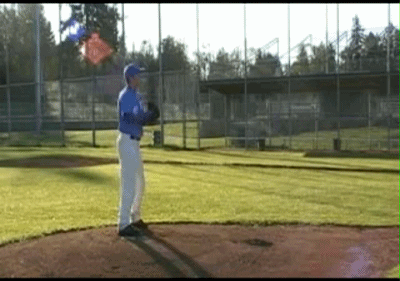
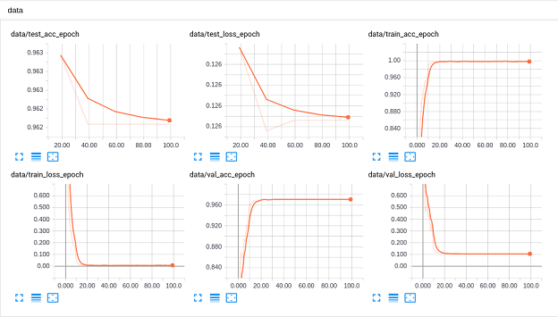
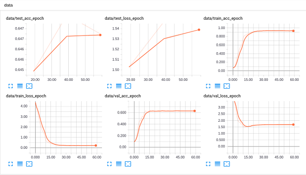

# pytorch-video-recognition

<table style="border:0px">
   <tr>
       <td></td>
       <td></td>
   </tr>
</table>

## Introduction
This repo contains several models for video action recognition,
including C3D, R2Plus1D, R3D, inplemented using PyTorch (0.4.0).
Currently, we train these models on UCF101 and HMDB51 datasets.
**More models and datasets will be available soon!**

**Note: An interesting online web game based on C3D model is in [here](https://github.com/jfzhang95/project-demo).**

## Installation
The code was tested with Anaconda and Python 3.5. After installing the Anaconda environment:

0. Clone the repo:
    ```Shell
    git clone https://github.com/jfzhang95/pytorch-video-recognition.git
    cd pytorch-video-recognition
    ```

1. Install dependencies:

    For PyTorch dependency, see [pytorch.org](https://pytorch.org/) for more details.

    For custom dependencies:
    ```Shell
    conda install opencv
    pip install tqdm scikit-learn tensorboardX
    ```

2. Download pretrained model from [BaiduYun](https://pan.baidu.com/s/1saNqGBkzZHwZpG-A5RDLVw) or 
[GoogleDrive](https://drive.google.com/file/d/19NWziHWh1LgCcHU34geoKwYezAogv9fX/view?usp=sharing).
   Currently only support pretrained model for C3D.

3. Configure your dataset and pretrained model path in
[mypath.py](https://github.com/jfzhang95/pytorch-video-recognition/blob/master/mypath.py).

4. You can choose different models and datasets in
[train.py](https://github.com/jfzhang95/pytorch-video-recognition/blob/master/train.py).

    To train the model, please do:
    ```Shell
    python train.py
    ```

## Datasets:

I used two different datasets: UCF101 and HMDB.

Dataset directory tree is shown below

- **UCF101**
Make sure to put the files as the following structure:
  ```
  UCF-101
  ├── ApplyEyeMakeup
  │   ├── v_ApplyEyeMakeup_g01_c01.avi
  │   └── ...
  ├── ApplyLipstick
  │   ├── v_ApplyLipstick_g01_c01.avi
  │   └── ...
  └── Archery
  │   ├── v_Archery_g01_c01.avi
  │   └── ...
  ```
After pre-processing, the output dir's structure is as follows:
  ```
  ucf101
  ├── ApplyEyeMakeup
  │   ├── v_ApplyEyeMakeup_g01_c01
  │   │   ├── 00001.jpg
  │   │   └── ...
  │   └── ...
  ├── ApplyLipstick
  │   ├── v_ApplyLipstick_g01_c01
  │   │   ├── 00001.jpg
  │   │   └── ...
  │   └── ...
  └── Archery
  │   ├── v_Archery_g01_c01
  │   │   ├── 00001.jpg
  │   │   └── ...
  │   └── ...
  ```

Note: HMDB dataset's directory tree is similar to UCF101 dataset's.

## Experiments
These models were trained in machine with NVIDIA TITAN X 12gb GPU. Note that I splited
train/val/test data for each dataset using sklearn. If you want to train models using
official train/val/test data, you can look in [dataset.py](https://github.com/jfzhang95/pytorch-video-recognition/blob/master/dataloaders/dataset.py), and modify it to your needs.

Currently, I only train C3D model in UCF and HMDB datasets. The train/val/test
accuracy and loss curves for each experiment are shown below:

- **UCF101**

<p align="center"></p>

- **HMDB51**

<p align="center"></p>

Experiments for other models will be updated soon ...
